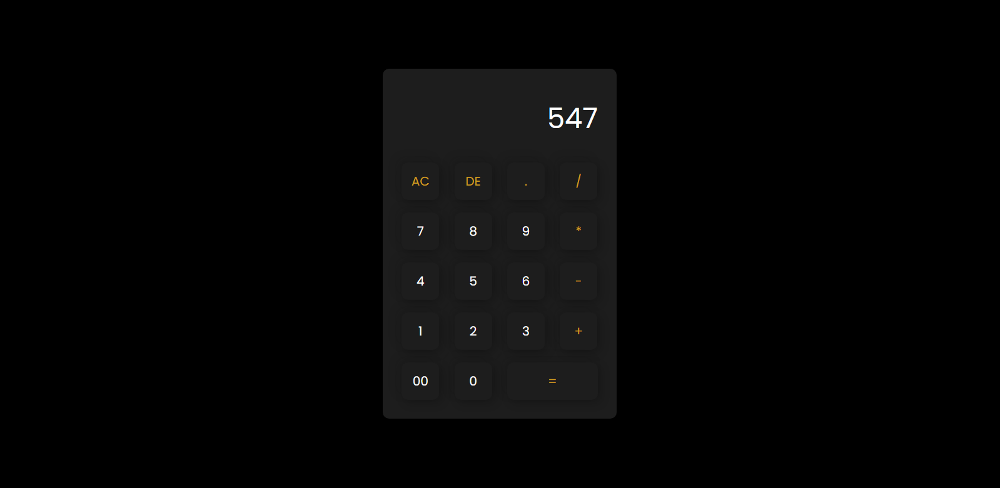

<h1 align="center">

- Calculadora Simples -

</h1>

#### [Acesse o projeto](https://nwerit.github.io/calculadora-simples/)

## 💭 Sobre o projeto

Fiz essa calculadora com fins de pesquisa. O projeto foi feito em mais ou menos 2 dias, onde visei deixar o código mais limpo e tentei extrair o máximo de HTML, sem tanto auxilio de JavaScript.

Estou tentando me aprimorar mais ainda com as ferramentas que já tenho conhecimento sobre, mas sempre estou em busca de conhecer novas tecnlogias, sejam elas, linguagens, frameworks e a fins.

## ❕ Depoimento 

Mesmo sendo um projeto bem básico sinto que consegui aplicar da maneira em que eu queria, por ser limitado conseguir traçar o que poderia ou não ser feito, sendo assim, segui a linha de raciocínio mais simples e pude entregar em pouco tempo, me ajudou tanto em questão de estimar projetos, como em conseguir colocar em prática todas as ideias que pensei.

### 💬 Construído com

- [HTML](https://developer.mozilla.org/en-US/docs/Web/HTML)
- [CSS](https://en.wikipedia.org/wiki/CSS)
- [JavaScript](https://www.javascript.com/)

## ⚪ Como contribuir?

1. Primeiro, [bifurque este repositório](https://github.com/Nwerit/calculadora-simples). Isso adicionará a versão atual do repositório à sua conta.

2. Agora você pode baixá-lo para sua máquina e alterar o que quiser (recomendo usar o [Live Server](https://marketplace.visualstudio.com/items?itemName=ritwickdey.LiveServer) para testes).
